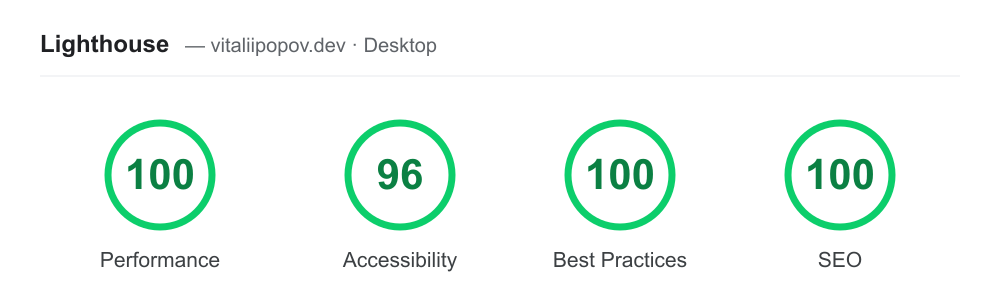

# Portfolio Hub

[](https://github.com/Yeezy2277/portfolio-hub/actions/workflows/ci.yml)
[](https://github.com/Yeezy2277/portfolio-hub/actions/workflows/codeql.yml)

A **hub-and-spoke** portfolio. This site (the *hub*) is a small Next.js app that
**auto-discovers** your projects from GitHub and showcases them as cards linking
to independently deployed live apps (the *spokes*). Add the `portfolio` topic to
a repo → it appears here. No per-project wiring, no monorepo.

> **Live demo:** _add your Vercel URL here_

---

## Performance

Lighthouse (PageSpeed Insights) on the live site — desktop:



## How it works

```
GitHub repos (topic: portfolio)  ──discovery via API──▶  Hub (Next.js · Vercel · ISR)
                                                          │  renders cards
Spoke deploy ──POST /api/revalidate──▶ hub refreshes      ▼
                                              Visitor browses, links out to live apps
```

1. **Discovery.** At build/ISR time the hub calls the GitHub API for your public
   repos and keeps the ones tagged with the `portfolio` topic
   ([`lib/projects.ts`](lib/projects.ts)).
2. **Overrides.** Each spoke repo may commit a `.portfolio.json` to control its
   card (title, summary, tags, preview image, `featured`, `order`, `hidden`) —
   see [`examples/.portfolio.example.json`](examples/.portfolio.example.json).
   Without it, the card falls back to the repo description, homepage and topics.
3. **Local seed.** [`config/projects.local.ts`](config/projects.local.ts) always
   renders, so the hub builds on a fresh clone with zero config. A seed entry and
   a discovered repo with the same `id` are merged (live GitHub data enriches the
   seed).
4. **Previews.** Clicking a card opens a modal. If the project opts in with
   `"embeddable": true` it loads live in an iframe; otherwise (many sites send
   `X-Frame-Options: DENY`) the modal shows a screenshot with an "Open live"
   link. A card with no explicit `image` derives a live screenshot from its
   `liveUrl` via `image.thum.io` (free, keyless); commit a `preview.png` and
   point `image` at it for full control.
5. **Freshness.** The page is statically generated and revalidates hourly. A
   spoke can trigger an instant refresh by calling `POST /api/revalidate` after
   it deploys — copy [`examples/spoke-notify-hub.yml`](examples/spoke-notify-hub.yml)
   into the spoke repo.

---

## Adding a project

1. Push the project to its own repo and deploy it (Vercel / GitHub Pages / …).
2. On the repo, add the topic **`portfolio`** and set the **homepage** to the
   live URL.
3. (Optional) Commit a `.portfolio.json` to fine-tune the card.
4. (Optional) Add the notify-hub workflow for instant refresh.

That's it — the card shows up on the next revalidation.

---

## Running locally

```bash
npm install
cp .env.example .env.local   # set GITHUB_USER (everything else is optional)
npm run dev
```

Environment (`.env.local`):

| Var | Purpose |
| --- | --- |
| `GITHUB_USER` | Whose repos to discover. Unset → only the local seed renders. |
| `PORTFOLIO_TOPIC` | Topic to match (default `portfolio`). |
| `GITHUB_TOKEN` | Optional PAT — raises the API rate limit (60 → 5000/hr). |
| `REVALIDATE_SECRET` | Shared secret for `POST /api/revalidate`. |

Scripts: `npm run dev` · `build` · `start` · `lint` · `typecheck`.

---

## Deploying

Import the repo in Vercel, set the env vars, deploy. Add the URL above. CI
([`.github/workflows/ci.yml`](.github/workflows/ci.yml)) runs lint · typecheck ·
build on every push.

---

## Structure

```
app/
  page.tsx                 # home — fetches projects, renders grid (ISR)
  opengraph-image.tsx      # generated social card (next/og)
  api/revalidate/route.ts  # on-demand refresh, called by spokes after deploy
components/
  ProjectGrid.tsx          # client: search + tag filter + modal state
  ProjectCard.tsx          # card: preview, tags, live/code links
  PreviewModal.tsx         # iframe when embeddable, screenshot fallback otherwise
lib/
  projects.ts              # GitHub discovery + fetch (server)
  merge.ts                 # pure merge/sort pipeline (unit-tested)
  merge.test.ts            # node --test
  preview.ts               # client-safe screenshot URL
  types.ts                 # Project view model
config/projects.local.ts   # always-on seed manifest
examples/                  # .portfolio.json + spoke notify workflow to copy
```

Run the tests with `npm test` (Node's built-in runner — no extra deps).
